# Биллинг оплаты обучения

[](https://github.com/Sawa243/tuition-billing/actions/workflows/ci.yml)

Система, через которую студент вуза платит за обучение, а бухгалтерия видит, кто сколько
должен и откуда взялась каждая цифра. Вместе с ней написан **учебный эмулятор платёжного
шлюза** — отдельный сервис, повторяющий поведение настоящего провайдера вроде ЮKassa.

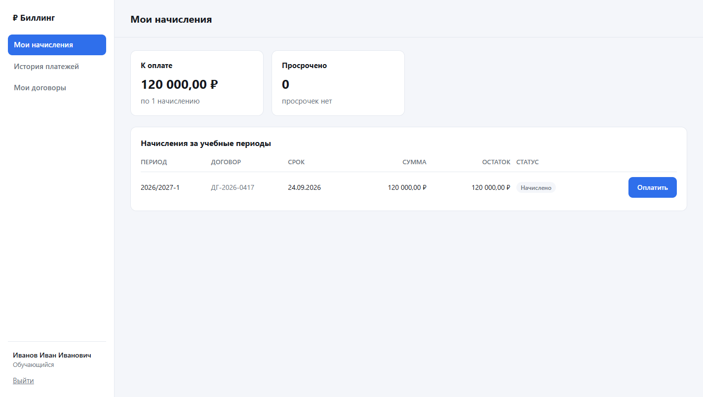

---

## Зачем это

Оплата обучения выглядит простой ровно до первого расхождения. Студент нажал «Оплатить»
дважды — списалось два раза. Уведомление от банка потерялось — деньги ушли, а в системе
долг. Бухгалтер вернул часть суммы — и остаток по договору больше не сходится ни с чем.

Поэтому система построена вокруг трёх вещей:

**Деньги не теряются.** Каждое движение денег — операция двойной записи. Поля «баланс»
в базе нет вообще: сальдо считается по проводкам, а проводки только добавляются. Ошибка
исправляется сторнирующей операцией, а не правкой строки, так что история всегда полная.

**Повтор безопасен.** Создание платежа идемпотентно, уведомления от шлюза можно доставлять
сколько угодно раз, а запрос чека в кассу провайдера уходит через исходящий ящик с ключом
идемпотентности — второй чек не пробьётся.

**Своим данным о чужих деньгах не верим.** Статус платежа берётся только из ответа шлюза
на прямой запрос. Уведомление — всего лишь повод сходить и спросить.

Заказчиком выступила бухгалтерия университета: требования собраны из действующего порядка
оплаты обучения — какие бывают договоры, как начисляется семестровая оплата, как работает
рассрочка и в каких случаях оформляется возврат.

---

## Как устроено

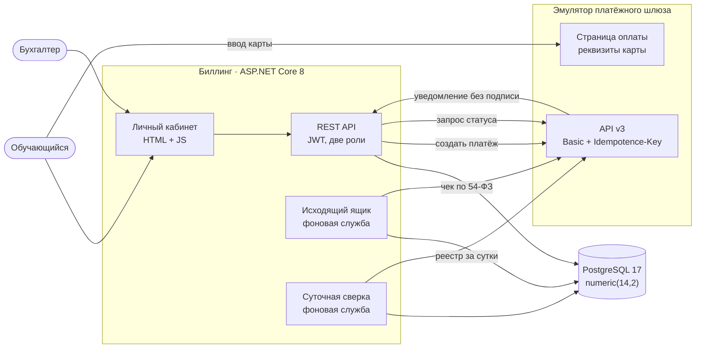

Реквизиты карты вводятся на странице шлюза и в биллинг не попадают никогда. Для вуза как
торгово-сервисного предприятия это принципиально: карточные данные не проходят через его
инфраструктуру, и он остаётся в самой лёгкой категории требований PCI DSS.

Внутри биллинг разложен на четыре проекта: `Domain` — правила учёта, которые ничего не знают
про базу и HTTP; `Application` — сценарии; `Infrastructure` — EF Core, клиент шлюза, фоновые
службы; `Api` — контроллеры, аутентификация и статика кабинета.

### Как проходит платёж

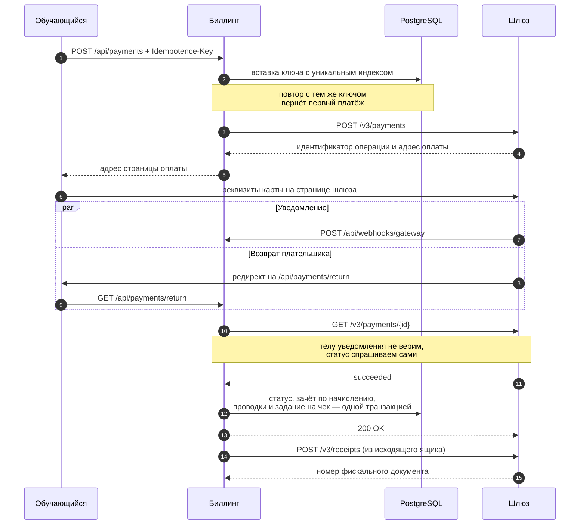

Уведомление и возврат плательщика приходят одновременно — это нормальный ход событий,
а не редкая гонка. Оба пути ведут в один и тот же код смены статуса, а от одновременной
записи защищает системный столбец `xmin` в роли метки версии: проигравший просто увидит,
что работа уже сделана.

### Состояния платежа

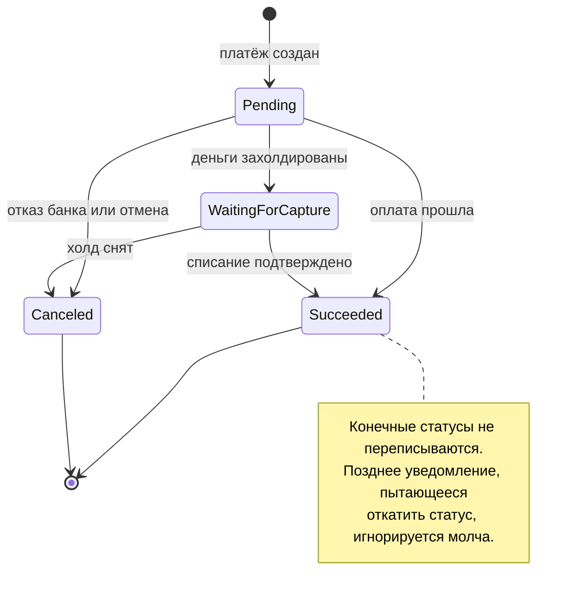

Состояния повторяют модель ЮKassa: если менять эмулятор на настоящего провайдера, автомат
переписывать не придётся.

---

## Что система умеет

Бухгалтер заводит договор об оказании платных образовательных услуг, выставляет по нему
начисление за учебный период и при необходимости разбивает его на рассрочку — сумма делится
поровну, а остаток копеек уходит в последнюю часть, чтобы части в точности сложились
в начисление. Ошибочное начисление отменяется сторнирующей проводкой, а не удалением.

Студент видит свои начисления, сроки и просрочки, платит целиком или частями, получает
квитанцию с номером кассового чека и смотрит историю операций.

Бухгалтер оформляет возврат — полный или частичный, — видит оборотную ведомость по плану
счетов, журнал операций с расшифровкой каждой проводки и результаты суточной сверки
с реестром шлюза.

| Экран | Что на нём |
|---|---|
| 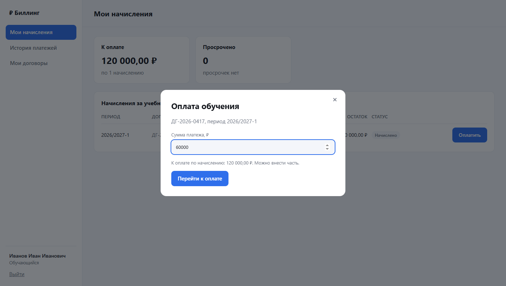 | Оплата целиком или частью |
| 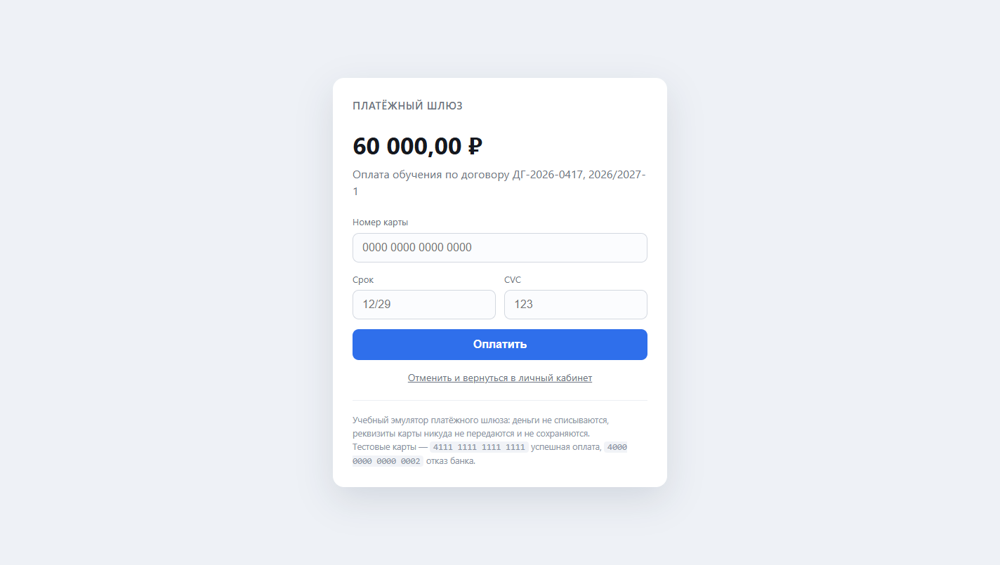 | Карта вводится на стороне шлюза |
| 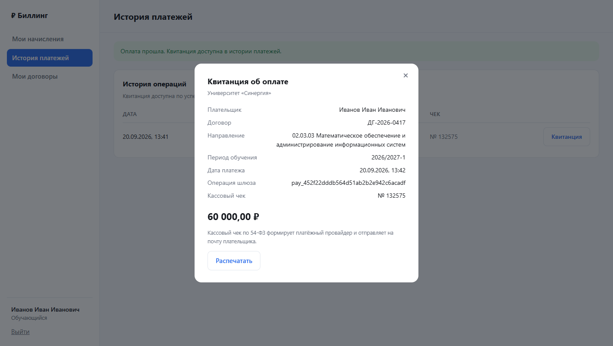 | Квитанция с номером фискального документа |
| 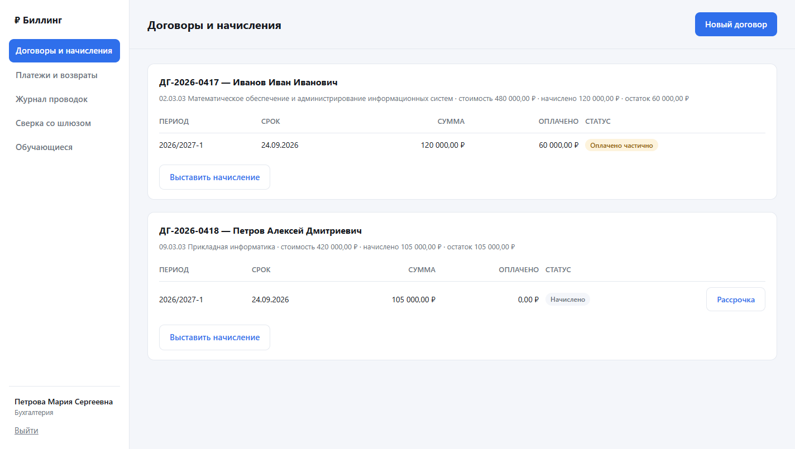 | Договоры, начисления и рассрочка глазами бухгалтера |
| 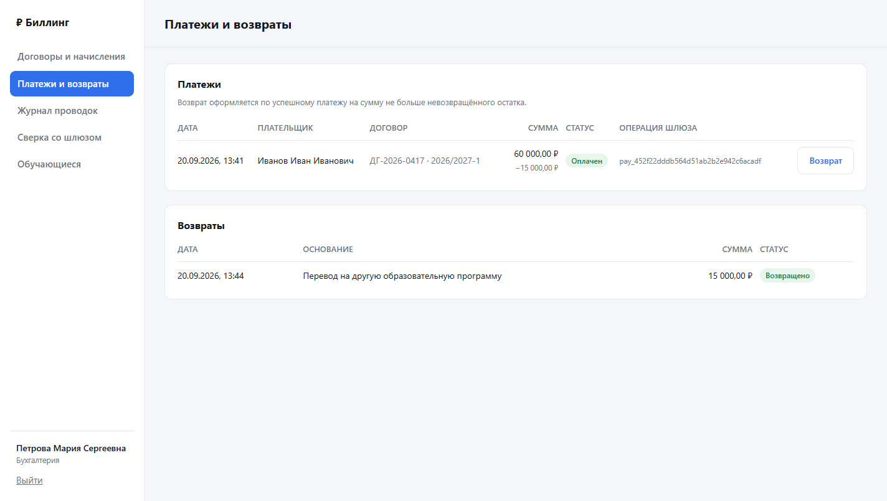 | Платежи и оформление возврата |
| 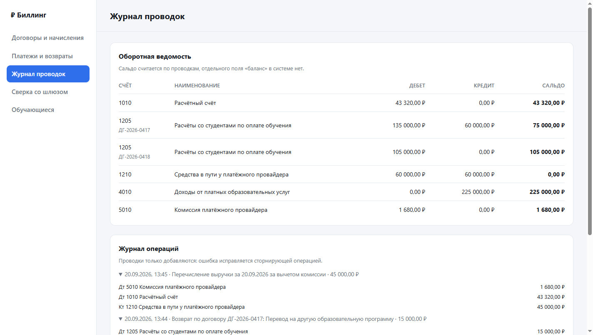 | Оборотная ведомость и журнал операций |
| 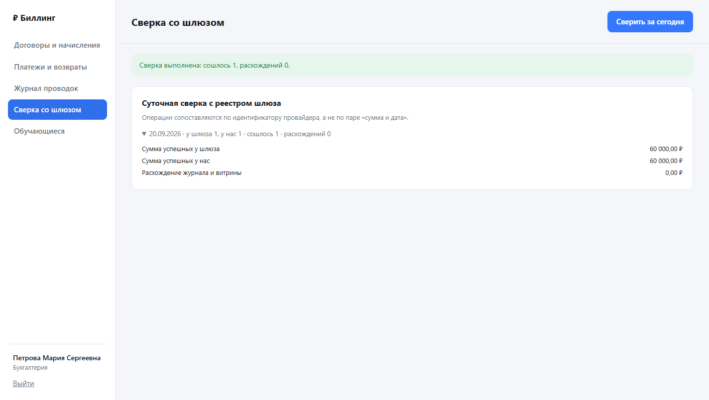 | Суточная сверка с реестром шлюза |

---

## Быстрый старт

```bash
cp .env.example .env   # заполнить пароли и ключи
docker compose up --build
```

Кабинет откроется на `http://localhost:5080`, страница оплаты — на `http://localhost:5090`,
описание API — на `http://localhost:5080/swagger`.

При первом запуске создаются демонстрационные учётные записи с паролями из `.env`:
`buh@synergy.local` — бухгалтерия, `ivanov@synergy.local` и `petrov@synergy.local` —
обучающиеся. На странице шлюза работают две тестовые карты: `4111 1111 1111 1111` —
оплата проходит, `4000 0000 0000 0002` — банк отказывает.

Без Docker сервисы поднимаются так же, но PostgreSQL нужно поставить самому, а секреты
удобно держать в `dotnet user-secrets` — они лежат вне папки проекта и физически не могут
случайно закоммититься:

```bash
dotnet user-secrets --project src/TuitionBilling.Api set "ConnectionStrings:Billing" "..."
dotnet user-secrets --project src/TuitionBilling.Api set "Jwt:SigningKey" "..."

dotnet run --project src/PaymentGateway.Emulator --urls http://localhost:5090
dotnet run --project src/TuitionBilling.Api      --urls http://localhost:5080
```

### Переменные окружения

| Переменная | Зачем |
|---|---|
| `POSTGRES_DB`, `POSTGRES_USER`, `POSTGRES_PASSWORD` | База данных |
| `POSTGRES_PORT` | Порт базы наружу, по умолчанию 55432 |
| `JWT_SIGNING_KEY` | Ключ подписи токенов доступа, не короче 32 символов |
| `GATEWAY_SHOP_ID`, `GATEWAY_SECRET_KEY` | Реквизиты магазина для API шлюза |
| `GATEWAY_FEE_PERCENT` | Комиссия провайдера, нужна для реестра сверки |
| `BILLING_PORT`, `GATEWAY_PORT` | Порты сервисов |
| `BILLING_PUBLIC_URL` | Внешний адрес биллинга: на него шлюз возвращает плательщика |
| `WEBHOOK_ALLOWED_IP_0` | Сеть, с которой принимаются уведомления. Пусто — проверка выключена |
| `SEED_ENABLED` | Создавать ли демонстрационные данные при старте |
| `SEED_ACCOUNTANT_PASSWORD`, `SEED_STUDENT_PASSWORD` | Пароли демонстрационных учёток |

Секретов в репозитории нет: `appsettings.json` содержит только структуру и значения
по умолчанию, а `.env` и `appsettings.Development.json` закрыты в `.gitignore`.

---

## API

Полное описание — в Swagger на `/swagger`. Коротко:

| Метод и адрес | Кто может | Что делает |
|---|---|---|
| `POST /api/auth/login` | все | Вход, выдаёт токен |
| `GET /api/auth/me` | все вошедшие | Кто я и с какими ролями |
| `GET /api/contracts` | все вошедшие | Договоры; студент видит только свои |
| `POST /api/contracts` | бухгалтер | Завести договор |
| `POST /api/contracts/{id}/invoices` | бухгалтер | Выставить начисление за период |
| `GET /api/invoices` | все вошедшие | Начисления, `?onlyUnpaid=true` — только с остатком |
| `POST /api/invoices/{id}/installments` | бухгалтер | Оформить рассрочку |
| `POST /api/invoices/{id}/cancel` | бухгалтер | Отменить начисление со сторно |
| `POST /api/payments` | студент | Создать платёж, требует `Idempotence-Key` |
| `GET /api/payments` | все вошедшие | История платежей |
| `GET /api/payments/{id}/receipt` | владелец, бухгалтер | Квитанция об оплате |
| `GET /api/payments/return` | без токена | Возврат плательщика со страницы шлюза |
| `POST /api/webhooks/gateway` | шлюз | Приём уведомления |
| `POST /api/refunds` | бухгалтер | Оформить возврат |
| `GET /api/ledger/accounts` | бухгалтер | Оборотная ведомость |
| `GET /api/ledger/transactions` | бухгалтер | Журнал операций с проводками |
| `POST /api/reconciliation/run` | бухгалтер | Прогнать сверку за дату |

Ошибки возвращаются в формате `application/problem+json`. Нарушение бизнес-правила — это
409 или 422, а не 500: клиент сделал осмысленный запрос, просто сейчас так нельзя.

---

## Тесты

```bash
dotnet test tests/TuitionBilling.Domain.UnitTests      # правила учёта, без базы
dotnet test tests/TuitionBilling.Api.IntegrationTests  # нужен PostgreSQL
```

**56 юнит-тестов** проверяют доменную логику: деление рассрочки на части, распределение
оплаты по графику, переходы автомата платежа, сведение дебета с кредитом, отказ принимать
суммы точнее копейки.

**41 интеграционный тест** поднимает оба сервиса через `WebApplicationFactory` и гоняет
их по настоящему HTTP — биллинг ходит в шлюз через его тестовый обработчик. База при этом
настоящая, PostgreSQL, а не SQLite: `numeric`, уникальные индексы и `xmin` ведут себя
одинаково только на той СУБД, с которой система поедет в работу.

Строка подключения к тестовой базе берётся из `TEST_DB_CONNECTION`, по умолчанию
`Host=localhost;Port=55432;Database=tuition_billing_tests;Username=billing`.

Тестирование безопасности — не отдельный инструмент, а часть того же набора: подделка
уведомления, повторная доставка, обращение к чужому платежу, попытка студента заглянуть
в журнал проводок, вход с неверным паролем, разбор масок из списка адресов провайдера.

---

## Нагрузка: измеренные цифры

Прогон NBomber по обоим сервисам в конфигурации Release. Железо: AMD Ryzen 5 5600
(6 ядер, 12 потоков), 32 ГБ оперативной памяти, Windows 10, PostgreSQL 17.11 на той же
машине. Генератор нагрузки работал там же, то есть соперничал с сервисами за процессор —
на выделенном стенде числа были бы выше.

```bash
export LOAD_ACCOUNTANT_PASSWORD=... LOAD_STUDENT_PASSWORD=...
export LOAD_SECONDS=30 LOAD_READ_RATE=1500 LOAD_HISTORY_RATE=600 LOAD_CREATE_RATE=400 LOAD_WEBHOOK_RATE=600
dotnet run --project tests/TuitionBilling.LoadTests -c Release
```

| Общая нагрузка | Чтение начислений | История | Создание платежа | Приём уведомления | Отказы |
|---|---|---|---|---|---|
| 265 запросов/с | p95 3 мс | p95 4 мс | p95 5 мс | p95 4 мс | 0 |
| 3 100 запросов/с | p95 42 мс | p95 47 мс | p95 79 мс | p95 38 мс | 0 |
| 4 100 запросов/с | p95 249 мс | p95 315 мс | p95 440 мс | p95 178 мс | 0 |
| 6 200 запросов/с | p95 8,0 с | p95 8,8 с | p95 8,2 с | p95 3,6 с | 0 |

Отказов не было ни в одном прогоне — на пределе система не теряет запросы, а выстраивает
их в очередь. Рабочим пределом этой конфигурации разумно считать около **четырёх тысяч
запросов в секунду**: до этой отметки время ответа держится в сотнях миллисекунд, после —
растёт до секунд.

Создание платежа тяжелее остальных сценариев закономерно: внутри него запись в базу
и синхронный поход во внешний шлюз.

Для понимания масштаба: в вузе с десятью тысячами студентов пик приходится на несколько
дней в начале семестра. Даже если половина заплатит в один час, это около полутора
запросов в секунду на создание платежа — на три порядка ниже измеренного предела.

---

## Решения, которые стоит объяснить

**Деньги — только `decimal` и `numeric(14,2)`.** Двоичная плавающая точка не представляет
точно даже 0,1, и ошибки накапливаются. Тип `money` в PostgreSQL не используется намеренно:
его не рекомендует сама документация Postgres. Суммы точнее копейки домен не принимает,
а округление идёт арифметическое, а не банковское — так считает бухгалтерия.

**Идемпотентность — на уникальном индексе, а не на проверке.** Схема «посмотреть, нет ли
такого ключа, потом вставить» гонку не закрывает: два запроса пройдут проверку одновременно.
Поэтому строка сразу вставляется, и если база ответила нарушением уникальности, возвращается
результат первого запроса. Тот же ключ с другими данными — это ошибка, а не повтор.

**Уведомления шлюза не подписываются.** Так устроены настоящие провайдеры: у ЮKassa подписи
вебхука нет вообще, подлинность проверяется списком адресов отправителя и обратным запросом
статуса. Эмулятор повторяет это поведение намеренно, а биллинг обязан перезапрашивать статус.

**Исходящий ящик нужен из-за 54-ФЗ.** Кассовый чек пробивает касса провайдера, но состав
услуги передаёт магазин — одной суммой чек не пробить. Записать платёж в базу и сходить
по HTTP в кассу одной транзакцией нельзя: упадём между шагами — либо деньги зачтены без
чека, либо чек пробит по несуществующему платежу. Поэтому в транзакции пишется задание,
а доставкой занимается фоновая служба. Гарантия получается «хотя бы один раз», и запрос
уходит с ключом идемпотентности. Ставка НДС — «без НДС»: образовательные услуги освобождены
подпунктом 14 пункта 2 статьи 149 Налогового кодекса.

**Сверка сопоставляет по идентификатору операции, а не по сумме и дате.** Время у сторон
расходится, а одинаковых сумм в вузе сколько угодно — все первокурсники платят один и тот же
семестр. Заодно сверка проверяет саму себя: сальдо дебиторки по журналу проводок должно
совпадать с суммой непогашенных начислений, и расхождение здесь означает потерянную проводку.

**Отдельного типа «деньги» нет.** Система однова́лютная, и обычный `decimal` оставляет
рабочим суммирование на стороне базы — с типом-обёрткой `SUM()` в запросе пришлось бы
заменять выборкой в память.

**Без сторонней библиотеки утверждений в тестах.** FluentAssertions с версии 8.0 перешла
под коммерческую лицензию Xceed, отзывную по усмотрению правообладателя. Тащить это
в учебный проект не хочется, а форк ради синтаксического сахара избыточен — штатных
`Assert` хватает. Лицензия NBomber разрешает бесплатное академическое использование.

---

## Что нашлось при тестировании

Три дефекта, которые выглядели работающим кодом, пока их не проверили.

**Поддельное уведомление блокировало настоящее.** В первой редакции повторы отсекались
уникальным индексом по ключу «событие + операция + статус». Проверка на подделку показала
дыру: кто угодно, зная адрес, отправлял поддельное `succeeded` первым, ключ оказывался
занят, и настоящее уведомление отбрасывалось как дубль — оплата не зачислялась. Теперь
таблица событий работает журналом аудита, а от повторов защищает сам автомат платежа.
На эту историю есть отдельный тест, чтобы она не повторилась.

**Новое начисление сохранялось как `UPDATE`.** Сущности выдают себе идентификатор
в конструкторе, а EF Core решает «новое или существующее» по тому, пуст ли ключ. Начисление,
добавленное в коллекцию уже отслеживаемого договора, уезжало в базу обновлением строки,
которой там нет. Лечится явным `Add`.

**График рассрочки молча оставался неоплаченным.** При зачёте платежа начисление
подгружалось вместе с планом рассрочки, но без его частей — распределять оплату было
не по чему. Внешне всё выглядело правильно: начисление оплачено, а график пуст.

---

## Чего здесь нет

Честный список того, что за рамками работы.

Нет настоящего платёжного провайдера и настоящего 3-D Secure: шлюз учебный, деньги
не двигаются, а «оплата картой» — это форма с двумя предопределёнными номерами. Клиент
шлюза написан по формату ЮKassa, так что подмена реализации — это один класс, но проверить
её без договора с провайдером невозможно.

Возвраты у эмулятора выполняются сразу; у настоящих провайдеров возврат может обрабатываться
асинхронно, и тогда понадобится такой же автомат состояний, как у платежа.

Двухстадийная схема с холдированием денег поддержана эмулятором и доменом, но биллинг
её не использует — оплата одностадийная.

Уведомления студентам о приближении срока оплаты не реализованы: для них нужен почтовый
сервис, которого в учебном контуре нет.

Масштабирование описано, но не реализовано: сейчас это монолит с вынесенным шлюзом.
Измеренная пропускная способность на три порядка выше реальной нагрузки вуза, так что
реплики на чтение и шардирование сейчас были бы решением несуществующей задачи.

Резервное копирование сводится к ежедневному `pg_dump`: допустимая потеря данных — сутки,
восстановление — от пятнадцати минут до часа ручной работы. Доступность честно заявляется
как 99 процентов в рабочее время, потому что инфраструктура демонстрационная, без
резервирования.

.NET 8 — ветка с поддержкой до 10 ноября 2026 года. Для учебного проекта это не проблема,
но при развитии первым делом стоит перейти на следующую версию с долгой поддержкой.

---

## Лицензия

MIT, текст — в файле [LICENSE](LICENSE).
